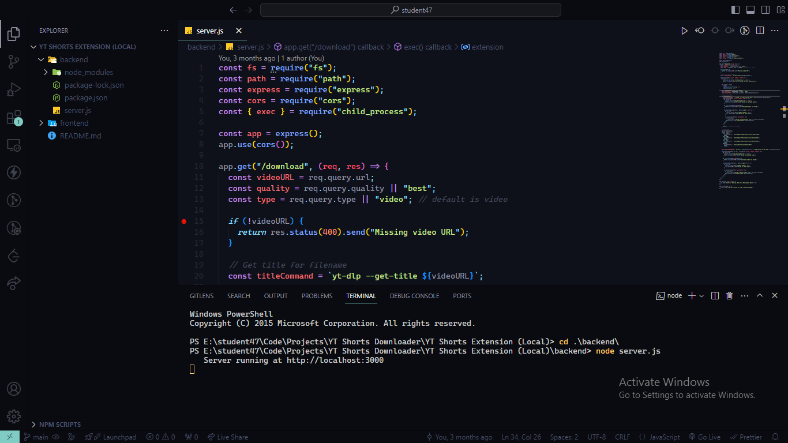
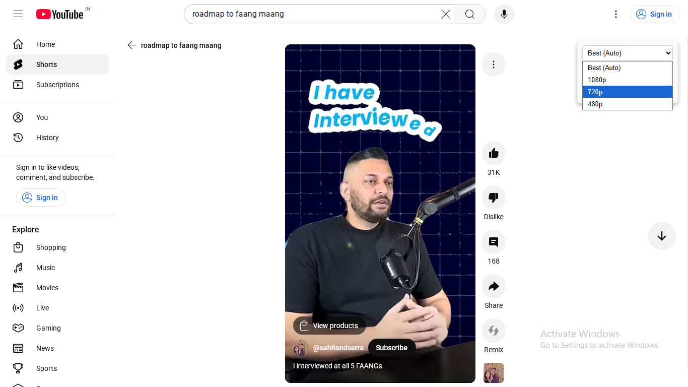
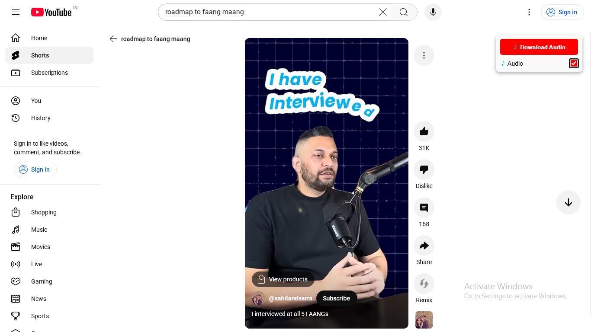
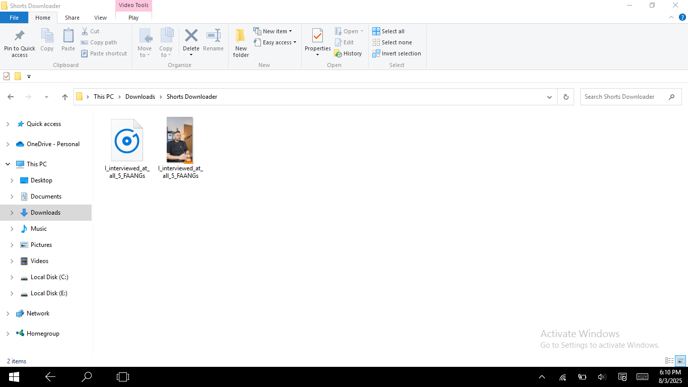

# 📥 YouTube Shorts Downloader (Chrome Extension)

A clean, fast, and hybrid solution that allows users to **download YouTube Shorts** as video or audio with a single click. It combines a **Chrome Extension frontend** with a **Node.js + yt-dlp backend** to ensure high-quality downloads and format control.

---

## 🎬 Demo & Screenshots

### ▶️ Demo Video

<p align="center">
  <a href="https://www.youtube.com/watch?v=S3j9kYdmvMI">
    
  </a>
</p>

> _Click the image above or [watch the demo](https://www.youtube.com/watch?v=S3j9kYdmvMI)_

---

### 🖼️ Screenshots

#### 🔘 Download Button Injected


#### 🎞️ Format Selection UI


#### 🎧 Audio Download Option


#### ✅ Successfully Downloaded


---

## 🔧 Tech Stack

### 🧩 Frontend (Chrome Extension)

* **Manifest V3** – Latest Chrome extension architecture  
* **JavaScript** – Injects logic into YouTube Shorts pages  
* **DOM Manipulation** – Adds custom download buttons  
* **CORS** – Communicates with local Node.js server  

### 🖥 Backend (Node.js Server)

* **Node.js + Express** – Handles download requests  
* **yt-dlp** – Core tool to download video/audio from YouTube  
* **FFmpeg** – Merges video and audio streams  
* **child_process** – Executes shell commands  
* **fs, path** – Handles files and cleanup  

---

## ✨ Features

* 🎯 **Auto-detects YouTube Shorts pages**
* 🔘 **Adds Download Button** with MP4 or MP3 options
* 🎞️ **Select Video Quality** (1080p, 720p, etc.)
* 🎧 **Audio-only download** (MP3 support)
* 🔃 **Automatic file cleanup** after each download
* 🔐 **100% local & secure** – No data leaks or trackers

---

## 🧱 Project Structure

```

yt-shorts-downloader/
│
├── extension/            # Chrome extension files
│   ├── manifest.json
│   ├── content.js
│   └── icon.png
│
├── server/               # Node.js backend
│   ├── server.js         # Express API + yt-dlp
│
├── screenshots/          # Screenshots for README
│   ├── 1\_server.png
│   ├── 3\_audio\_download.png
│   ├── 4\_video\_options.png
│   └── 5\_downloaded.png
│
└── README.md

````

---

## 🚀 Setup Instructions

### 1️⃣ Backend Setup (Node.js + yt-dlp)

```bash
cd server
npm install express cors
pip install yt-dlp   # Ensure yt-dlp is in PATH
````

➡️ Make sure **FFmpeg** is also installed
🔗 [Download FFmpeg](https://ffmpeg.org/download.html)

```bash
node server.js
```

> Server will start at `http://localhost:3000`

---

### 2️⃣ Frontend Setup (Chrome Extension)

1. Open Chrome → `chrome://extensions/`
2. Enable **Developer Mode**
3. Click **Load Unpacked**
4. Select the `extension/` folder
5. Visit a Shorts URL like `https://youtube.com/shorts/xyz`
6. Click the **Download** button shown below the video

---

## ⚙️ Permissions Summary

| Permission         | Purpose                                    |
| ------------------ | ------------------------------------------ |
| `scripting`        | Inject code into YouTube Shorts pages      |
| `activeTab`        | Interact with the current YouTube tab      |
| `host_permissions` | Allow API calls to `http://localhost:3000` |

---

## 📦 Dependencies

### Node.js:

* `express`
* `cors`
* `fs`, `path`, `child_process` (built-in)

### External Tools:

* [`yt-dlp`](https://github.com/yt-dlp/yt-dlp)
* [`ffmpeg`](https://ffmpeg.org/)

---

## 🛡️ Security & Cleanup

* 🔐 Downloads are handled **locally**
* 🗑️ Temporary files are deleted after download
* 🚫 No 3rd-party API, no tracking

---

## 🛠️ Author & Credits

Built with ❤️ by **Gaurav Pawar**
🌐 [gauravpawar.netlify.app](https://gauravpawar.netlify.app)

---

## 🧠 Future Additions

* ✅ Format dropdown UI
* ☁️ Optional deployment via Render or Railway
* 📱 Extension popup for mobile-friendliness
* 🧠 Auto quality fallback & best format detection


